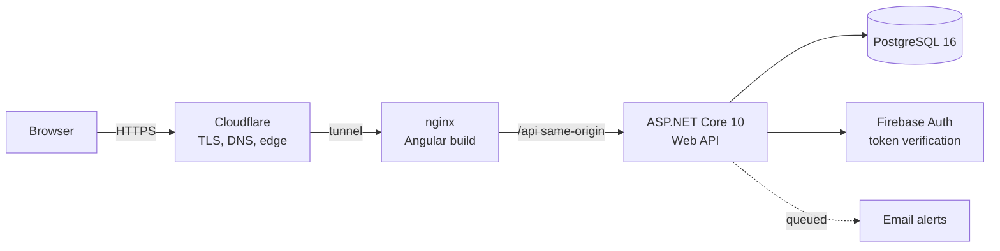

# Finance Management

A personal finance tracker built around a simple idea: people overspend because spending is invisible between paydays. Income arrives once or twice a month, expenses happen every day, and without a running picture of the two, the gap only becomes obvious after it matters.

This app makes that picture visible. It tracks income and expenses, splits a monthly budget by the 50/30/20 rule, and warns you when a category is heading over before the month ends.

**Stack:** Angular 19 · ASP.NET Core 10 (C#) · PostgreSQL 16 · Firebase Auth · Docker

---

## Why it works this way

The budgeting model is not invented. It follows the *Personal Finance Management Handbook* (KVK, Nordplus, 2017), which builds on three principles:

| Principle | Rule of thumb |
| --- | --- |
| Spend less than you earn | The whole point |
| Avoid debt | Keep debt payments under 20% of income |
| Save first, then spend | Set aside 20% before living on the rest |

That last one drives the default budget split:

- **50% Needs** — housing, food, utilities, transport
- **30% Wants** — dining out, entertainment, subscriptions
- **20% Savings** — emergency fund, goals, debt repayment

Every transaction can be classified as a Need, a Want or Savings, so the split is measured against real behaviour rather than intention.

One deliberate choice about tone: the app shows data and lets you decide. It does not scold. Low income while meeting your basic needs is already a skill, and an app that treats that as failure gets closed and never reopened.

---

## What it does today

**Tracking**
- Income and expense transactions with description, amount, category and date
- Need / Want / Savings classification, falling back to the category default
- Custom categories

**Budgeting**
- Monthly budget with a 50/30/20 default split
- Per-category limits
- Overspending detection, with email alerts when a category crosses its limit

**Reporting**
- Dashboard with the current month at a glance
- Month and year drilldowns (`/dashboard/month/:year/:month`, `/dashboard/year/:year`)
- Period summaries generated server-side

**Accounts and security**
- Firebase Auth, email/password and Google sign-in
- reCAPTCHA Enterprise and Firebase App Check on the API
- Login attempt tracking with lockout escalation and IP blocking
- Admin email alerts on repeated failed logins

---

## Architecture



Three containers, composed together: the Angular production build served by nginx, the .NET API, and Postgres. The browser only ever talks to nginx, which proxies `/api` to the backend on the same origin, so there is no CORS surface and no public database port.

The API and the database bind to loopback. Nothing reaches them except through the edge.

Email alerts go through a background queue (`IBackgroundTaskQueue` and a `QueuedHostedService`) rather than blocking the request that triggered them, so a slow mail provider cannot slow down saving a transaction.

**On deployment:** this runs self-hosted from a single machine behind a Cloudflare tunnel, with nightly `pg_dump` backups on a 30-day retention. That is a deliberate trade: it costs nothing to run and taught me far more about operating a system than a managed platform would have, but it is only up when that machine is. It previously ran on Fly.io with Supabase and Cloudflare Pages. There is no public demo link here because a link that is sometimes down is worse than no link.

### Hosting it 24/7

The host is a Windows laptop running the stack inside WSL2 (Ubuntu), on a
**native `dockerd` managed by systemd** -- not Docker Desktop.

That distinction was earned. Under Docker Desktop the daemon lived in an
interactive user session, so nothing came up until someone logged in, and
bind-mount sources were resolved through a `docker-desktop-bind-mounts` shim
that silently substituted an empty directory whenever a path did not exist on
the host. A missing Firebase key therefore presented as a healthy container
returning 500s on every authenticated request, rather than as a failure to
start. Native `dockerd` resolves paths in the distro directly and starts from
systemd at distro init, so both problems disappear.

One invariant is worth knowing before touching any of this:

> **WSL tears a distro's userspace down when no Windows process is attached to
> it** -- systemd, `dockerd` and every container go with it, and the next
> `wsl.exe` call silently re-inits the lot. The `FinanceManagement-Startup`
> scheduled task runs `scripts/ensure-stack-up.sh --hold`, which never returns.
> That task process *is* the keepalive. It is supposed to sit in the Running
> state forever; if it ever shows Ready, the stack is down. Do not "fix" it to
> exit, and do not give it an execution time limit.

Install or repair the task with `scripts/install-startup-task.ps1`. Run it
elevated -- only an Administrator can register the `AtStartup` trigger and the
S4U principal that let the stack come up with nobody logged in. Unelevated it
still installs, but only triggers at logon. Boot progress is logged to
`startup.log` in the repo root.

---

## Running it locally

You need Docker and Docker Compose. Nothing else.

```bash
git clone https://github.com/Wenhao0706/Finance-management.git
cd Finance-management

cp .env.example .env
# Set POSTGRES_PASSWORD. Everything else has a working default or can stay empty
# for local use; email alerts and App Check simply stay off without their keys.

# Firebase Auth needs a service account for token verification:
# Firebase Console -> Project Settings -> Service accounts -> Generate new key
# Save it as backend/firebase-service-account.json

docker compose up --build
```

The frontend comes up on <http://localhost:8081>. The API applies its EF Core migrations on start, so there is no separate migration step.

### Without Docker

```bash
# API
cd backend
dotnet restore
dotnet run

# Frontend, in a second shell
cd frontend
npm install
npm start
```

`frontend/proxy.conf.json` points the dev server at the local API.

---

## Project layout

```
backend/            ASP.NET Core Web API
  Controllers/      Transactions, Budgets, Categories, AuthEvents
  Services/         Budget calculation, alert detection, notifications, lockout
  Models/           EF Core entities
  Middleware/       Firebase auth, App Check, IP blocking
  Migrations/       EF Core migrations
backend.tests/      xUnit unit and integration tests
frontend/           Angular 19 standalone components
  src/app/
    components/     dashboard, transactions, transaction-form, settings, login
    guards/         route protection
    interceptors/   auth token attachment
    services/       API clients
deploy-agent/       Container that polls the repo and redeploys
```

---

## Tests

```bash
cd backend.tests
dotnet test
```

xUnit, covering budget calculation, alert detection, the background queue, lockout escalation, notification dispatch, period summaries, IP blocking and the email sender, plus integration tests against the API.

---

## Security

Secrets never enter the repository. `.env`, service account JSON and `appsettings.Development.json` are all gitignored, `.env.example` documents every key with no values, and the history has been audited: the only settings file ever committed was the default scaffold, which carried logging levels and nothing else.

Postgres and the API both bind to `127.0.0.1`, so neither is reachable from the LAN, let alone the internet. Traffic enters through nginx only.

The API sits behind Firebase token verification and App Check. HSTS, CSP, `X-Frame-Options`, `X-Content-Type-Options`, `Referrer-Policy` and `Permissions-Policy` are all set at the edge.

If you are reading this as a reviewer: `backend/Middleware/` is the place to start.

---

## Where it is going

The feature set is planned in tiers. Tier 1 is built, Tier 2 is partly built.

| Tier | Focus | Examples |
| --- | --- | --- |
| 1 Core | Track and budget | Transactions, 50/30/20 budgets, dashboard, overspending alerts |
| 2 Smart awareness | Classify and warn | Need/Want tagging, category limits, debt ratio monitor |
| 3 Planning | Goals and projections | Savings goals, what-if projections, loan calculator |
| 4 Behavioural nudges | Guide and educate | Weekly summaries, subscription creep detection |
| 5 Advanced | Expand | Multi-currency, investment tracking, family budgets, exports |

---

## A note on how this was built

I built this with heavy AI assistance, from planning through to deployment, and I would rather say that plainly than have it inferred.

The reason it is worth mentioning is that the interesting part turned out to be where the assistance stops being useful. Generated code compiles and looks reasonable long before it is correct. Deciding the budget model, working out why the edge returns a 530 while every container reports healthy, choosing to bind Postgres and the API to loopback so the tunnel is the only way in, moving email onto a background queue after watching a request hang waiting on the mail provider — that is the part I had to understand myself, and it is the part I can talk through.

---

**Author:** Yoon Man Hou · [GitHub](https://github.com/Wenhao0706) · [LinkedIn](https://www.linkedin.com/in/yoon-man-hou-483ba237b/)
